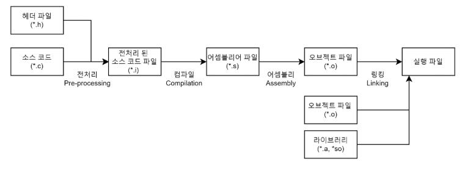

### FPS

#### FPS(Frame Per Second)

> 1초 동안 화면에 몇 개의 프레임이 출력되는지 나타내는 값

EX)

FPS 60 ⇒ 1초에 60번 화면이 갱신됨 → 프레임 하나당 16.67ms

#### 계산식

FPS = 1000 / 프레임당 소요 시간

한 프레임 처리에 10ms 걸리면 → 1000 / 10 = `100fps`

#### 게임에서 FPS가 중요한 이유

1. 체감 부드러움 ⇒ FPS 가 낮으면 캐릭터 움직임이 끊기듯 보임
2. 입력 반응성 ⇒ FPS가 낮으면 프레임 사이 간격이 길어져서 조작에 대한 화면 반응도 느려짐
3. 일관된 물리 / 게임 플레이 ⇒ FPS가 들쭉날쭉하면 캐릭터 이동속도, 점프, 궤적 등이 프레임마다 달라보일 수 있음

#### FPS 가 낮아지는 원인 - CPU GPU

CPU

* AI 연산
* 물리 연산
* Draw Call 증가
* GC 발생

GPU

* Triangle, Vertax 과다
* 복잡한 Shader
* Overdraw
* 포스트 프로세싱

#### 무조건 FPS가 높은것이 좋은것인가?

> FPS가 높을수록 일반적으로 화면이 부드럽고 입력 반응성이 좋아지지만, 디스프렐이 주사율 보다 지나치게 높은 FPS는 체감 효과에 비해 전력 소비와 발열을 증가시킬 수 있음 따라서 플랫폼과 장르에 맞는 목표 FPS를 설정하고 중요한 것은안정적으로 FPS를 일관되게 유지하는 것이 중요합니다

### 변수의 선언 VS 정의

### 선언

> 컴파일러에게 "이런 이름과 타입을 가진 변수가 존재한다" 라는 사실만 알려줌

⇒ 반드시 메모리 할당은 일어나지는 않음

### 정의

> 실제로 메모리 공간을 할당하는 것 ⇒ 정의는 선언을 포함

⇒ 실제로 메모리 공간을 할당 하는 것

### 컴파일 과정

#### 1. 전처리

> 전처리기를 통해 소스 코드 파일을 전처리된 소스 코드 파일로 변환하는 과정

* 주석제거
* 헤더 파일 삽입
  * #include 같은 전처리 지시문을 먼저 처리
* 매크로 치환 및 적용
  * #define 지시문에 정의된 매크로를 저장하고 같은 문자열을 만나면 #define 된 내용으로 치환된다.

#### 2. 컴파일

> 전처리가 끝난 소스 코드를 컴파일러를 통해 전처리된 소스 코드 파일을 `어셈블리어` 나 그에 준하는 중간 결과로 (파일로) 변환하는 과정

* 문법 검사
* 타입 검사
* 최적화
  * 불필요한 연산 제거
* 어셈블리 코드 생성
  * 저수준 명령어로 변환

#### 3. 어셈블리

> 어셈블러가 어셈블리 코드를 기계어로 변환하는 단계

* 명령 하나하나를 cpu가 직접 이해하는 0과1로 이루어진 이진 코드로 매핑

#### 4. 링킹

> 링커가 여러개의 오브젝트파일과 라이브러리 파일을 하나로 합쳐서 최종 실행 파일을 만드는 단계

### 32비트와 64비트 프로그램의 차이?

> CPU가 사용하는 주소 크기와 한 번에 처리할 수 있는 데이터 크기의 차이

#### 32비트

* 주소 크기 32비트
* 포인터 크기 : 4바이트
* 표현 가능한 주소 공간 : 4GB정도

2^32개의 주소 표현 가능

#### 64비트

* 주소 크기 : 64 비트
* 포인터 크기 : 8바이트

2^64개의 주소 표현 가능

#### 정리

> 32비트와 64비트의 가장 큰 차이는 주소 공간과 포인터 크기임32비트는 약 4GB 정도의 주소 공간을 사용할 수 있지만 64비트는 훨씬 큰 메모리를 사용할 수 있다.다만 64 비트는 포인터 크기가 커져 메모리 사용량이 증가할 수 있으며 무조건 성능이 더 빠른 것은 아니다

### IEnumerable<T>와 IEnumerator<T>를 비교하세요.

#### IEnumerable<T>

> 컬렉션이 반복 가능 하다는 의미.

#### IEnumerator<T>

> 실제 반복을 수행

#### 정리

`IEnumerable<T>`는 컬렉션이 순회 가능하다는 것을 나타내는 인터페이스이며 `GetEnumerator()`를 통해 `IEnumerator<T>`를 반환합니다. 반면 `IEnumerator<T>`는 실제 순회 상태를 가지고 `MoveNext()`로 다음 요소로 이동하고 `Current`를 통해 현재 요소에 접근합니다. 즉 `IEnumerable<T>`는 순회 가능한 대상이고, `IEnumerator<T>`는 그 대상을 실제로 순회하는 객체라고 볼 수 있습니다.

### 우선순위 큐에 힙을 사용하는 이유?

> 우선순위 큐는 가장 높은 우선순위의 원소를 빠르게 조회하고 제거하는 것이 핵심입니다. 힙은 루트에 항상 최댓값 또는 최솟값이 위치하기 때문에 우선순위가 가장 높은 원소를 O(1)에 확인할 수 있고, 삽입과 삭제도 트리 높이만큼만 조정하면 되므로 O(log N)에 수행할 수 있습니다. 또한 완전 이진 트리 구조라 배열로 구현할 수 있어 메모리와 캐시 효율도 좋습니다. 따라서 우선순위 큐를 구현하는 데 힙이 적합합니다.
