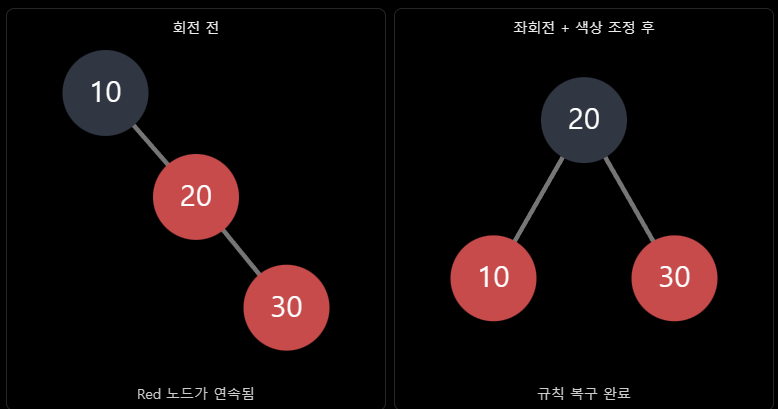

10/08
=====

청년 취업 사관학교 지원서 제출
-----------------

면접 스터디 회고
---------

### 이진 탐색 트리

#### 이진 탐색 트리

각 노드가 최대 2개의 자식을 가지며 왼쪽 서브트리의 모든 값 < 부모 < 오른쪽 서브트리의 모든 값 규칙을 모든 노드에서 만족하는 이진 트리
          8
        /   \
       3     10
      / \      \
     1   6      14
        / \     /
       4   7   13

⇒ 8의 왼쪽(1 3 4 6 7)은 모두 8보다 작고 오른쪽(10 13 14)은 모두 8보다 큼.

⇒ 비교 한 번으로 왼쪽·오른쪽을 결정해서 **탐색 범위를 절반씩 줄임**

#### 주요 연산

최악의 경우는 값이 오른쪽 혹은 왼쪽에만 편향되어 있을 때

10
  \
   20
     \
      30
        \
         40
           \
            50

`평균` **$O(\log N)$** `최악` $O(N)$

**탐색**

루트에서 시작해 작으면 왼쪽, 크면 오른쪽으로 내려감. 빈 자리에 도달하면 없는 값

**삽입**

탐색과 같은 경로로 내려가다가 빈 자리에 새 노드를 붙임

**삭제**

삭제할 노드의 자식 수에 따라 3가지 경우로 나뉨

#### 정리

이진 탐색 트리는 왼쪽은 작고 오른쪽은 크다는 규칙으로 정렬 상태를 유지하며, 비교할 때마다 탐색 범위를 절반씩 줄여 평균 O(log N)의 시간 복잡도를 가집니다. 중위 순회로 정렬된 결과를 얻을 수 있다는 장점이 있지만, 삽입 순서에 따라 한쪽으로 치우치면 O(N)까지 나빠질 수 있습니다.

### 레드 블랙 트리 ⇒ 이진 탐색 트리에서 한쪽으로 쏠린 최악의 경우를 해결하기 위함

#### 레드 블랙 트리

각 노드에 빨강/검정 색상을 부여하고 색상 규칙으로 트리의 균형을 유지하는 자가 균형 이진 탐색 트리

일반 이진 탐색 트리는 정렬된 순서로 삽입하면 한쪽으로 쏠려 O(N)이 되지만, 레드 블랙 트리는 삽입·삭제 때마다 색 변경과 회전으로 균형을 맞춰 항상 `O(log N)`을 보장합니다.

#### 시간 복잡도

탐색, 삽입, 삭제 ⇒ `$O(\log N)$`

정렬된 순서로 전체 순회 ⇒ `$O(N)$`

→ 높이를 O(log N)으로 제한

#### 5가지 규칙

1. 모든 노드는 빨강 또는 검정
2. 루트는 검정
3. 모든 리프 노드는 검정
4. 빨강 노드의 자식은 둘 다 검정 ⇒ 빨강이 연속으로 올 수 없음
5. 어떤 노드에서든 그 아래 NIL 리프까지 가는 모든 경로의 검은색 노드 수가 같다.

#### 균형을 유지하는 방법

1. 색상 변경
   노드의 색상을 빨강 또는 검정으로 바꾸는 방법

2. 회전
   노드 간 연결 구조를 회전시켜 트리의 형태를 변경하는 방법

예) 10 → 20 → 30을 삽입하면

### map / unordered_map

#### map

`레드-블랙 트리`(균형 이진 탐색 트리) 기반의 key-value 컨테이너. 키를 기준으로 항상 정렬된 상태를 유지함

삽입, 삭제, 검색 ⇒ `$O(\log N)$`

Key 순서 순회 ⇒ `$O(N)$`

⇒ 레드 블랙 트리 사용

**특징**

* 키가 정렬된 순서로 저장되고 순회
* 키 중복 불가
* 노드마다 힙에 개별 할당되므로 메모리가 흩어짐 ⇒ 캐시 효율이 낮음

#### unordered_map

`해시 테이블` 기반의 key-value 컨테이너. 키를 해시 함수에 넣어 나온 값으로 저장 위치를 결정하며 순서가 없음

삽입, 삭제, 검색 ⇒ `$O(1)$`

최악 ⇒ `$O(N)$` → 해시 충돌일 때

#### 쓰임새

**map**

* 키 순서대로 순회해야 할 때 (랭킹, 시간순 이벤트 처리)
* 범위 검색이 필요할 때 (특정 구간의 키 찾기)
* 최악의 경우에도 성능이 보장되어야 할 때

**unordered_map**

* 순서가 필요 없고 **키로 빠르게 조회**하는 것이 주목적일 때 (ID로 오브젝트 찾기, 아이템 정보 조회)

* 데이터가 많고 탐색이 빈번할 때
    // 게임 예시: 몬스터 ID로 즉시 조회 → unordered_map
    std::unordered_map<int, Monster*> monsterById;
    // 게임 예시: 점수 순위를 정렬된 채로 유지 → map
    std::map<int, string, std::greater<int>> ranking;  // 내림차순
